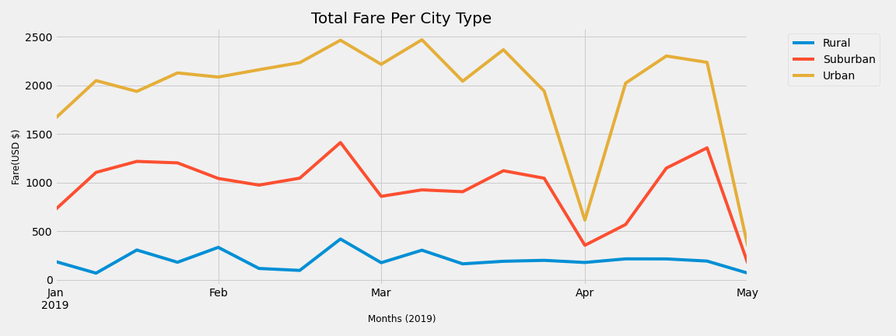
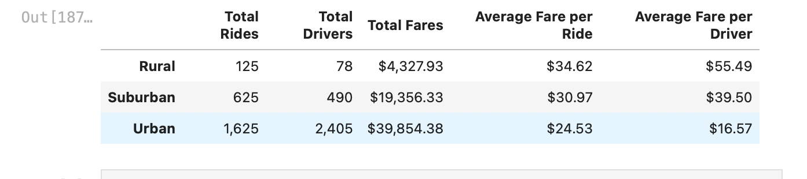
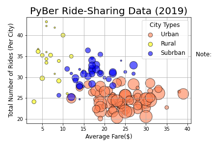

# PyBer_Analysis
## Overview:

The purpose of this challenge was to analyze the provided, Pyber, data: a ridesharing platform. The data provided was given in a CSV, which was then imported to Jupyter notebook and placed into a python environment. Pythons’ Pandas was used to create various DataFrames (DFs) to assist in the visualizations of the data.

## Results:

Image 1 (Total Fare by City Type) demonstrates that from January 2019 to April 2019 all city types had a steady month yield, with a slight increase towards the end of April.  The city type with the highest yield, was the urban setting: practically doubling the monthly yield of suburban cities and quintuple that of the rural cities.  

* figure 1. 

Urban cities are expected to have the highest yield, as it’s the area with a higher population, thus increased usage and more readily available drivers. When viewing the summary in the DataFrame (Fig2. below) a few observations could be made such as: the total rides per city, drivers, average fare per ride, and average fare per driver. The difference between total rides between rural and urban cities is significant as urban cities have thirteen (13) times the number of rides than rural cities. Urban cities have thirty-one (31) times more drivers than that of rural areas and five (5) times the drivers in suburban areas. The average fare per ride has around a 34.12% upcharge in rural areas, compared to urban areas. The average fare per driver, on the other had shown a significant difference in price between all city types: rural and urban areas had a 108.02% difference in price while suburban and urban areas had an 81.79% difference. The ratio between total rides and drivers would be about 0.68 I urban areas, 1.3 in suburban areas, and 1.6 in rural areas. 

* figure 2

 
* figure 3: This image shows the number of rides vs the average fare (USD $) per ride.

## Conclusion Summary: 
* Urban areas have the highest financial yield.

* The price per ride is less in Urban areas then the other areas as the total rides and drivers is higher, thus the cost per ride is less (supply and demand). This also has an impact on the average fare per driver, the urban drivers earn significantly less than the drivers in other areas.

* Those who live in rural areas have a higher fare per ride, as there are a smaller number of drivers available compared to that of the urban areas (supply and demand).

## Summary:

Below are a couple recommendations to address disparities among the city types:

* The data provided is fairly limited, as Its from January 2019 to April 2019. If the rest of the year would have been provided, an analysis of their yearly and seasonal statistics could have been understood. Does the price vary across different seasons? Does Weather impact the price? Do Certain holidays increase of decrease the price? Having the yearly data would provide extra incite. 

*	Rural areas have a severe gap in drivers and rides compared to the other city types, it may prove to be beneficial to invest in advertisements to promote the usage of the platform (across all city types).

* The quarterly yield of the rural areas isn’t even in competition with the yields of either suburban or urban areas. If rural areas were to be on par with at least suburban areas, which has a decent financial yield for a smaller population would be about 185 drivers per ride and about 274 rides. 
